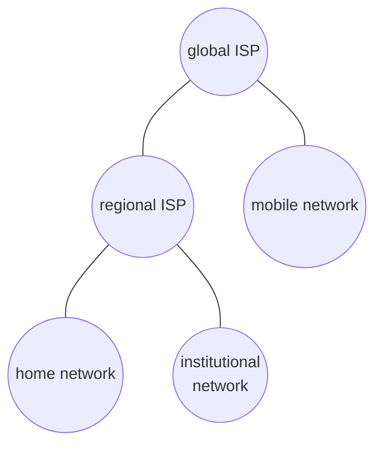

# Introduction to Computer Networks

###### tags: `MyNTUST`



[TOC]

Introduction
===

What is the Internet?
---

### "Nuts and Bolts" View (元件論)



- Hosts
    - PC
    - Laptop
    - IoT devices
    - End systems which connected each other
    - ~billions
- Communication links (傳輸媒介)
    - Fiber (光纖)
    - SNG car
    - Copper (銅纜)
    - Radio
    - Limited by **bandwidth (頻寬)**
- Packet switches
    - Router (路由器)
    - Switch (交換器)
    - Forward packets (封包) (chunk of data), like post office
- Internet (網際網路)
    - Network of networks
- Protocols (通訊協定)
    - TCP
    - IP
    - HTTP
    - 802.11
    - Skype
- Internet standards
    - RFC (Request for comments)
        - [RFC1149](https://datatracker.ietf.org/doc/html/rfc1149)
    - IETF (Internet Engineering Task Force)

### A service view

> Internet 提供哪些服務

- Distributing applications, providing services
    - Instant messaging
    - VoIP
    - Online games
    - E-commerce
    - Social nets
- Socket interface
    - Platform providing communication services for applications

### What's a protocol

- The rule to communication
- Human protocol
    ```mermaid
    sequenceDiagram
    Alice ->> Bob: Hi
    Bob ->> Alice: Hi
    Alice ->> Bob: Got the time?
    Bob ->> Alice: 2:00
    ```
- Machine protocol
    ```mermaid
    sequenceDiagram
    Client ->> Server: TCP connection request
    Server ->> Client: TCP connection response 
    Client ->> Server: Get http://www.awl.com/kurose-ross
    Server ->> Client: <file>
    ```

Network edge
---

### Network Structure

- Host (主機)
    - Clients (客戶端)
    - Servers (伺服器)
        - Often in datacenter
        - Edge computing / cloud computing
            - 在靠近 client 的地方增設 server，在靠近 client 的 server 運算稱為 edge-computing，在離 client 較遠的 server 上運算稱為 cloud-computing
                > 實際上沒有這麼單純
        - Offloading (卸載)
            - Server 自己負擔不了，所以交給別的 server 處理
            - Edge server 卸載給 cloud server
            - 4G 卸載給 3G
- Access networks, physical media
    - 存取網路的媒介
    - Wire: fiber, copper, etc.
    - Wireless: WiFi, starlink, etc.
- Network core
    - Interconnected routers

### Access Networks and Physical Media

- Connect end systems to edge router
- Bandwidth
    - 每秒可以傳多少資料
    - Often use bits per second (bps)
- May be dedicated (專屬) or shared
- DSL: digital subscriber line
    - 用 modem 將信號藉由既有的電話線傳輸至 DSLAM (DSL access multiplexer), DSLAM 將電話線上的網路訊號分離 (解調變) 出來
    - ADSL: 非對稱 DSL
        - 上傳下載速度不一樣
- Cable Network
    ```mermaid
    graph LR
    TV --- cm["cable modem"] --- |tv cable| ctms["CTMS"] --- ISP
    ```
    - Use TV cable (deliver in other frequency)
    - Frequency division multiplexing (FDM)
    - HFC (hybrid fiber coax)
        - 混和光纖同軸電纜
        - https://en.wikipedia.org/wiki/Hybrid_fiber-coaxial
- Home network
    - Access point
    - 家用 WiFi
- Enterprise network
    - 有自己的 network、switches、routers、gateway、firewall
    - 10Mbps~10Gbps
- Wireless access networks
    - Wireless LAN
        - 室內 (通常)
        - Wi-Fi (802.11 b/g/n)
        - 11, 54, 450 Mbps
    - Wide-area wireless access (WAN)
        - Telcom
            - 10's km 等級的距離
        - 1 ~ 10 Mbps
        - 3G, 4G: LTE
- Host sending function of data
    1. Takes message
    2. Split into chunks of length *L(bits)*
    3. Transmits in network by transmission rate *R(bits/sec)*
        - Transmission rate = bandwidth
        - Transmission delay(sec) = *L*/*R*

### Physical media

- Guided media
    - 訊號在導線內傳輸
    - TP (雙絞線)
        - UTP
        - STP
        - Cat 5: 100 Mbps ~ 1 Gbps
        - Cat 6: 10 Gbps
        - 
    - Fiber
        - 傳輸媒介是玻璃
        - 10 Gbps ~ 100 Gbps
        - 低出錯率
            - 不怕電磁干擾
    - Coax (同軸電纜)
        - 
- Unguided media
    - 訊號自由四處擴散
    - Radio
        - 透過電磁波傳遞
        - 會被反射、阻擋、干擾
        - Link types
            - Terrestrial microwave (地面微波站)
                - 45 Mbps
            - LAN
                - WiFi
                - 54 Mbps
            - Wide-area
                - 4G cellular
                - 10 Mbps
            - Satellite
                - 45 Mbps
                - 270 ms end-to-end delay
                - geosynchronous (同步衛星) or low altitude (低軌道衛星)

Network core
---

- Mesh of routers

### Packet Switching

- Hosts break app-layer messages into packets
- Store-and-forward
    
    - Entire packet must arrive at router before it can be transmitted (先儲存再轉送)
    - End-to-end delay = 2L/R (忽略其他delay)
- Queueing delay & loss
    - Arriving rate > transmission rate $\to$ queueing
    - Buffer full $\to$ packet dropped (lost) 
- Routing and Forwarding
    
    - Routing: 透過 routing algorithm 決定 source-destination route (封包傳送的路線)，產生 forwarding table
    - Forwarding: 參考 forwarding table 來轉送封包

### Circuit Switching

- End-end resources allocated to, reserved for "call" between source & dest
- Dedicated resources
    - Guaranteed performance
- Circuit segment idle if not used by call (no sharing)
- E.g. telephone network
- FDM
    - Split by frequency
    - 在不同頻段同時傳輸
- TDM
    - Split by time
    - 在不同時間（同個頻段）傳輸

### Packet Switching vs. Circuit Switching

- Packet switching allows more users to use network
    - n 個使用時間百分比為 p 的使用者中 k 個人同時上線的機率是 $\mathrm{ C }^n_k \cdot p^k \cdot (1-p)^{n-k}$ (二項式分布)
    - E.g. 35 個 user，每人只使用 10% 的時間，則 10 人以上同時上線的機率小於 0.0004
- Advantages of packet switching
    - Great for bursty (短時間大量的) data
    - Resource sharing
    - No call setup
- Disadvantages of packet switching
    - Excessive congestion (壅塞) will cause packet delay and loss
        - Protocols needed for reliable data transfer, congestion control
- Virtual circuit (VC)
    - Provide circuit-like behavior in packet switched network
    - https://en.wikipedia.org/wiki/Virtual_circuit

### Internet Structure


- Access ISPs
    - Internet Service Provider
    - 住家、公司、學校網路
    - 提供終端使用者連線到網際網路的服務
    - 發展性受**經濟**及**政治**影響
- Regional ISP
    - 提供地理位置鄰近的 Access ISP 之間的連線交換
- Peering link
    - 提供兩個 ISP network 互連
- Internet exchange point (IXP)
    - 在 ISP scope 外，提供多個 ISP 之間的連線交換
- Tier 1 ISP
    - 涵蓋範圍為一個或多個國家
    - PS: tier 1 需要 full mesh
    - e.g. Level 3, AT&T, Sprint, NTT
- Content provoder network
    - 由大公司提供的網路服務，等級和 tier 1 ISP 差不多

> 參考資料：[從 0 開始的 Web Security 系列](https://ithelp.ithome.com.tw/users/20129897/ironman/3431)

Delay, loss, throughput
---

- Delay
    - 處理 packet 所耗的時間
    - Transmission delay
        - packet 從開始傳送到完全送完所耗的時間
        - delay = bits/bps
    - Propogation delay
        - 從 router A to B 之間所耗的時間
        - 主要是物理因素
        - $\simeq 2 \times 10^8$ m/s
    - Nodal processing delay
        - 在 router 內部傳遞所耗的時間
        - check error bit
        - determine output link
        - $\lt 10^{-3}$ s
    - Queueing delay
        - 排 queue 所耗的時間
        - Congestion level
            - 塞車嚴重程度
        - Delay
            - R: 可處理的頻寬 (bps)
            - L: packet length (bits)
            - a: packet arrival rate
            - delay = La/R
                - $La/R \simeq 0$ : small delay
                - $La/R \to 1$ : very large delay
                - $La/R \gt 1$ : unstable, arriving more than consuming
        - [M/M/1 queue](https://en.wikipedia.org/wiki/M/M/1_queue)
    - Real world Internet delay & routes
        - `traceroute` on Linux
        - `tracert` on Windows
        
        ```
        C:\Users\CA-Lee>tracert ntust.edu.tw

        在上限 30 個躍點上
        追蹤 ntust.edu.tw [140.118.31.99] 的路由:

          1     2 ms     2 ms     3 ms  192.168.64.158
          2   163 ms   139 ms   180 ms  10.156.65.145
          3    26 ms    23 ms    17 ms  10.156.65.97
          4    22 ms    16 ms    23 ms  10.156.71.23
          5    19 ms    18 ms    20 ms  10.156.71.34
          6    28 ms    21 ms    23 ms  tpdb-3312.hinet.net [210.65.126.98]
          7    17 ms    23 ms    36 ms  tpdb-3031.hinet.net [220.128.1.254]
          8    18 ms    26 ms    29 ms  tpdt-3308.hinet.net [220.128.1.101]
          9    22 ms    23 ms    22 ms  tp-pc1-c12r2.router.hinet.net [203.75.135.1]
         10    20 ms    23 ms    28 ms  192.192.61.49
         11    23 ms    23 ms    21 ms  192.192.61.81
         12    22 ms    23 ms    30 ms  192.192.7.198
         13     *        *        *     要求等候逾時。
         14     *        *        *     要求等候逾時。
         15    28 ms    22 ms    29 ms  140.118.250.6
         16    19 ms    53 ms    25 ms  ntust.edu.tw [140.118.31.99]

        追蹤完成。
        ```
- Loss
    - Router's buffer 塞滿了，後面來的 packet 直接噴掉，不會進到 queue 也不會被處理
    - May be retransmission by previous node or source
    - M/M/1/k
- Throughput
    - 單位時間內可以通過（進入&離開）的資料量 (bps)
    - 分 instantaneous/average
    - 區段的 throughput 等於區段內最小的 throughput

Protocol Layers, Service Model
---

> 分層分工，模組化

- Internet protocol stack
    - Application (most top)
        - FTP, HTTP
    - Transport
        - TCP, UDP
    - Network
        - Routing
        - IP, routing protocols
    - Link
        - Transfer data to neighboring devices
        - Ethernet, 802.11 (Wi-Fi), PPP
    - Physical (most bottom)
        - 實體媒介，如線路
    - Physical is layer 1, application is layer 5
- OSI reference model
    - Published by ISO
    - 7 layer
        - Application
        - Presentation
            - Encrypt, decrypt, compression, etc.
        - Session
            - Manage connection (synchronization, checkpointing, recovery of data exchange)
        - Transport
        - Network
        - Link
        - Physical
    - Two layers was merged into application layer in Internet stack
- Encapsulation（封裝）
    ```mermaid
    graph TD
    subgraph "frame(link layer)"
    lheader["link header"]
    subgraph "datagram(network layer)"
    nheader["network header"]
    subgraph "segment(transport layer)"
    theader["transport header"]
    subgraph "message(application layer)"
    data
    end
    end
    end
    end
    ```
    - 不是每個 node 都要處理全部的layer
        - Only layer 1 (physical): Repeater
        - Only layer 1~2: Switch
        - Only layer 1~3: Router

Scurity
---

- Field
    - How to attack
    - How to defend
    - How to design an architechture that is immune to attacks
- 網際網路一開始並沒有考慮安全性
    - 預期大家都可以互相信任
- 每一層都可以做安全性防護

### 把惡意程式透過網際網路植入目標

- Virus
    - 透過使用者接收/執行某個程式
- Worm
    - 透過被動接收/感染
- Spyware
    - 可以記錄使用者金鑰、瀏覽紀錄
    - 可以暗中上傳資料到伺服器
- Botnet
    - 將電腦 compromised (攻破) 後用作殭屍主機，常被拿來進行 DDoS
- Denial of Service (DoS)
    - 惡意佔滿伺服器的處理資源，使服務無法被其他使用者使用
    - 步驟
        1. 找到目標
        2. 取得附近的網路中的殭屍電腦
        3. 使用大量的殭屍電腦發送服務請求給目標伺服器
- Packet sniffing
    - 嗅探（竊聽）
    - 工具軟體: wireshark
- IP spoofing
    - 偽造
    - 使用假的 IP 發送封包

History
---

### Early packet-switching priciples

- 1961: queueing theory，透過理論建立封包交換機制
- 1964: Baran - packet-switching in military nets
- 1967: ARPAnet (美國軍方網路) concevied by Advanced Research Projects
- 1969: 第一個 ARPAnet 節點開始運作
- 1972
    - ARPAnet 發布
    - NCP: 第一個 host to host 協定
    - 第一個email程式
    - ARPAnet 達到15個節點

### Internetworking, new and proprietary nets

- 1970: ALOHAnet satellite network in Hawaii
- 1974: Architechture for interconnecting networks
    - mininalism, autonomy
    - best effort
    - stateless routers
    - 去中心化控制 (管理)
- 1976: Ethernet at Xerox PARC
- late70's: proprietary architectures: DECnet, SNA, XNA
    - switching fixed length packets (ATM precursor)
- 1979: ARPAnet has 200 nodes
- Cerf and Kahn's internetworking principles
    - Minimalism, autonomy - no internal changes required to interconnect networks
    - Best effort service model
    - Stateless routers
    - Decentralized control

> 1973 年的*整個* Internet ([src.](https://www.weforum.org/agenda/2019/03/this-paper-map-shows-the-extent-of-the-entire-internet-in-1973))
> 

### New protocols, a proliferation of networks

- 1982: 制定 SMTP
- 1983: TCP/IP 上線
- 1983: 制定 DNS
- 1985: 制定 FTP
- 1988: 制定 TCP 流量控制規範
- 100,000 hosts

### Commercialization, the Web, new apps

- 1990's: ARPAnet 除役
- 1990's: Web 技術出現
- 1995: NSFnet 除役
- 1990 ~ 2000
    - Instant messaging, P2P file sharing
    - ~ 50 million hosts

### Present

- ~ 5B devices attached to Internet
- 更積極地布建寬頻設備
- 高速無線網路普及化
- 出現社群網路 (FB)
- Service providers (Google, Microsoft) 建立自己的網路
- 電子商務、大學、企業開始使用雲端運算

Application Layer
===

Principles of network applications
---

Web and HTTP
---

E-mail
---

DNS
---

P2P
---

Video streaming and content distribution networks (CDN)
---

Socket programming with UDP and TCP
---


- 目標是把實際的應用功能實作出來
- transport-layer 提供了哪些服務?
- client-server 模式
- peer-to-peer (p2p) 模式
- 有哪些常見協定
    - HTTP
    - FTP
    - SMTP/POP3/IMAP
    - DNS
- 建立一個有網路功能的程式

Network app
---

- a program that runs on (different) end system
- communicate over network
- no need to write program for network-core device (e.g. routers)
- p2p
    - 每個 end system 都是 client & server

Client-server architecture
---

- server
    - always on
    - permanent IP address
    - data centers (串聯多台硬體主機) for scaling
- client
    - communicate with server
    - may be intermittently (間歇性地) connected
    - may have dynamic IP addresses
    - do not communicate directly with each other

P2P architecture
---

- no always-on server
- arbitary (數個) end systems directly communicate
- peers reauests server from other peers, provide service in return to other peers
    - self scalability
        - more peer, more capacity
- peer may have no permanent connection and IP address
    - cause more complexity to management
        - 有時會有中心伺服器負責協調節點
        - Pure P2P: have no central server to manage peers
- e.g. file sharing

Processes communicating
---

- process is a program running within a host
- communicating
    - in same host
        - inter-process communication
        - defined by OS
    - in different hosts
        - by exchanging messages
        - communicated over network
- client process
    - process that initiates (create) communication
    - 主動發起連線
- server process
    - process that waits for connections
    - 被動接受連線

Sockets
---

- 應用層和傳輸層的對話窗口
    - 可以當成傳送門，資料丟進去就會傳到對方那邊，剩下的不用管

Addressing processes
---

- 為了分辨不同的 process，所以分派不同的 port 編號給不同的 process
- IP 定位 host，port 定位 host 內的 process

App-layer protocol defines
---

- types of messages exchanged
    - e.g. request, response
- message syntax
    - what fields in messages
    -  how fields are delieated
- message sematics
    - meaning of ingormation in fields
- rules 
    - for when and how processes send
    - respond to messages
- open protocols
    - defined in RFCs
    - allows for interoperability
    - e.g. HTTP, SMTP
- proprietary protocols
    - e.g. Skype 
    - private
    - usually used in company


transport service
---

- data intergrity
    - 100% reliable date transfer
    - other apps(audio) can tolerate some loss
- timing
    - some apps require low delay to be "effective"
- throughput
    - some apps(multimedia)  require minimum amount of throughput to be "effective"
    - otherapps("elastic apps") make use if whatever tyroughput they get

Transport service requirements: common apps
---

| application   | dataloss | throughput | time sensitive |
| ------------- | -------- | ---------- | -------------- |
| file transfer |          |            |                |

transport protocols service
---


- TCP sevice
    - reliable transport
    - flow control
    - congestion control
    - does not provide
    - connection-oriented
- UDP service
    - unreliable date transfer
    - does not provide
- protocol 沒有提供的功能，你可以自己做；~~台電不能給你的，IKEA可以。~~

internet apps: application, transport protocols
---
| application            | application layer protocol  | underlying transport protocol |
| ---------------------- | --------------------------- | ----------------------------- |
| e-mail                 | SMPT[RFC 2821]              | TCP                           |
| remote terminal access | Telnet[RFC 854]             | TCP                           |
| Network Management     | e.g. 路由器間同步路由表資料 | UDP                           | 

Securing TCP
---
- TCP & UDP
    - no encryption
    - cleartext passwds sent into socket travers internet in cleartext
- SSL
    - socket layer
    - provieds incrypted TCP
    - data integrity
    - end-point authentication
- SSL is at app layer
    - apps use SSL libraries, that "talk" to TCP
- SSL socket API
    - cleartext in secured tunnel

Web and HTTP
---
- web page consists of sbjects
- object can be HTML file, JPEG image, JAVA applet, audio file
- web page consists of base HTML-file includes several refrenced objects
- each object is addressable by a URL

HTTP overview
---
- HTTP: hypertext transfer protocol
    - client intiates TCP connection to server, port 80
    - server accepts TCP connection from client
    - HTTP messages and Web server
    - TCP connection closed
- HTTP is "stateless
    - servr maitains no information about past client requests

HTTP connections
---

- non-persistent HTTP
    - at most one object sent over TCP connection
        - connection then closed
    - downloading multiple objects required multiple connections
- persistent HTTP
    - multiple objects con be sent over single TCP connection between client, server


Persistent HTTP
---

- non-persistent HTTP issues
    - requires 2 RTTs per object
    - OS overhead for each TCP connection
    - browsers often open parallel TCP connections to fetch refrenced objects
- persistent HTTP
    - server leaves connection open after sending response
    - subsequent HTTP messages between some client/server sent over open connection
    - client sends requests as soon as it encounters a refrenced object
    - as little as one RTT for all the referenced objects

Transport layer
---

- network layer
    -  logical communication between hosts
-  transport layer:
     - logical communication between processes
    - relies on, enhances, network layer services

demultiplexing
---
- host revieces IP datagrams
    - each datagram has source IP address destination IP address
    - each datagram carries one transport-layer segment 
    - each segment has source, destination port number
    - host uses IP address & port numbers to direct segment to appropriate socket
- TCP socket identified by 4-tubpe
    - source IP address
    - source port number
    - dest IP address
    - dest port number
- demux
    - reciever uses all four values to directo segment to appropriate socket
    
UDP
---


Transport Layer 
===


Transport-layer services 
---


multiplexing and demultiplexing
---


connectionless transport: UDP
---


principles of reliable data transfer
---

connection-oriented transport: TCP
---


principles of congestion control
---

TCP congestion control
---


Contributors
===

- [calee](https://calee.tw)
- [Issues](https://github.com/jp05451)
- [alston](https://github.com/Alston-Jan)
- [Eliot](https://github.com/eliot0507)

:::info
@CA-Lee : 目前 line 487 前都已經整理過了
::: 
